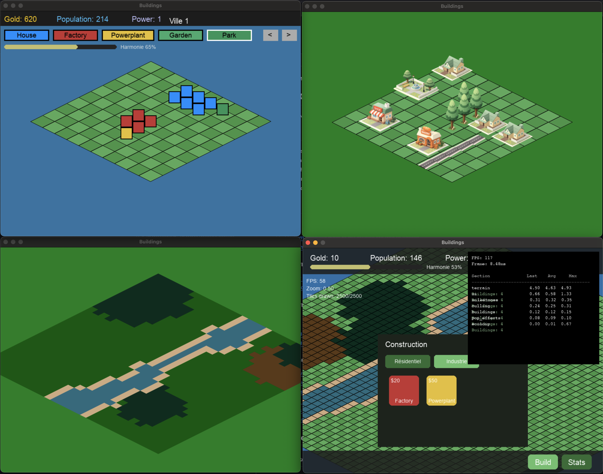

# Learn Pygame by Doing!

WIP: A collection of games built with pygame




## Foreword

I am writing the document and the blog posts at the moment. Please by patient


## How to make it run on your computer

### Prerequistes

- Python (3.9 <= python <= 3.11)
- the `venv` module (it should be by default but we never know).

### Clone the repo

### Set up a Virtual env

```bash
# On Linux

# On Mac
# 1. Install the env
python3 -m venv .venv
# 2. Activate it
source .venv/bin/activate

# On Windows
# 1. Install the env

# 2. Activate it
venv/Scripts/activate

```


### Install the dependencies

```bash
pip install -r requirements.txt
```


### Run the game

Since there are 5 iterations of the game, if you want to run each of them,
you'll need to `cd` inside each directory.

For example:

```bash
# Let's say I want to try v5
cd ./v4
python main.py
```

Be aware that:
- if you want to launch v5 (well, I mean 4 but I started counting at 0), you'll have
  to call the file `main.py`.
- if you want to launch v0, v1, v2, and v3, you'll have to call the file
  `app.py`.


**I'll update the docs and add links for the articles once they are written**.

